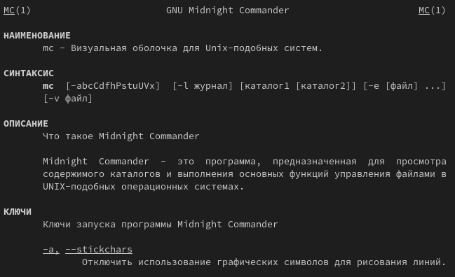
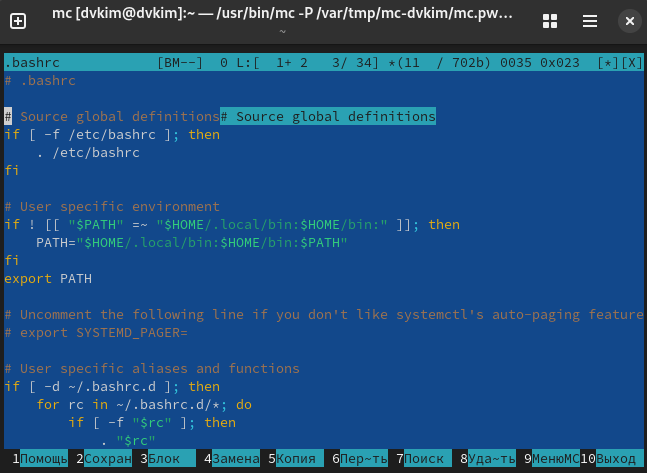
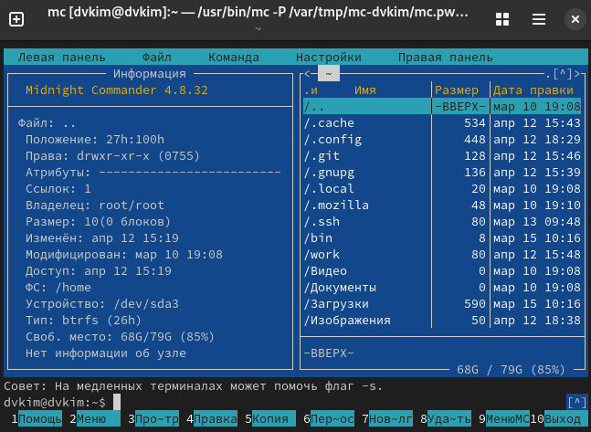
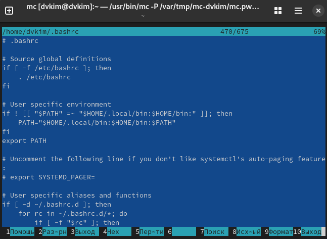
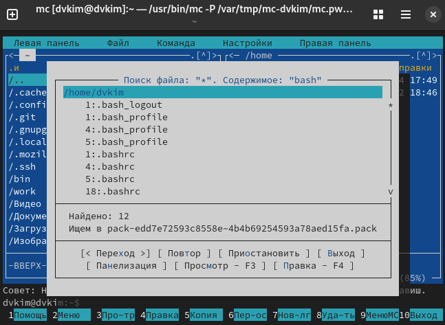
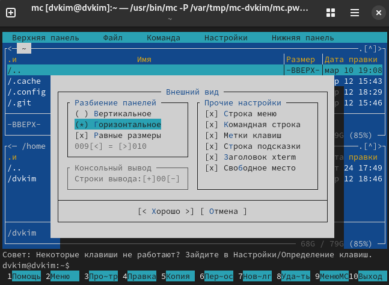
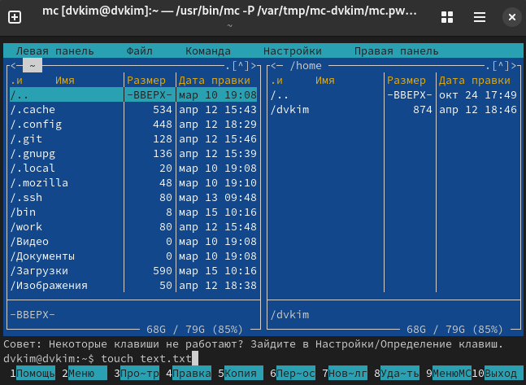
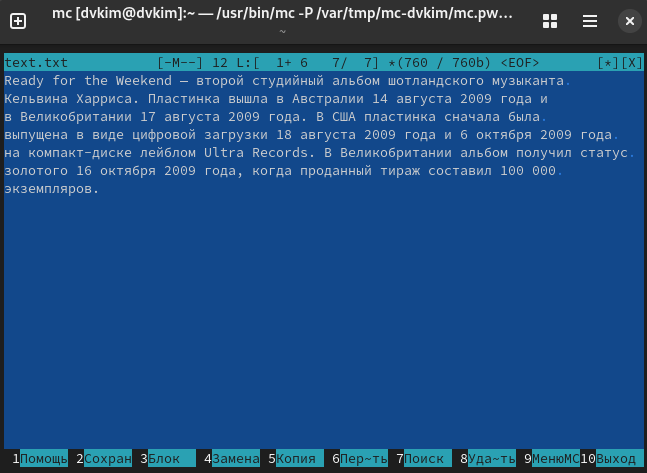
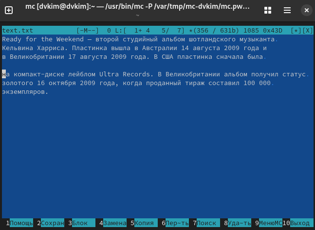
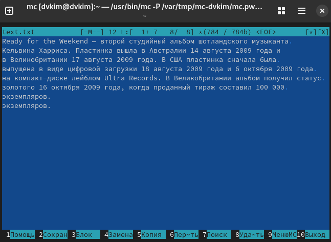

---
## Front matter
lang: ru-RU
title: Лабораторная работа №9
subtitle: Операционные системы
author:
  - Ким Д. В.
date: 12 апреля 2025

## i18n babel
babel-lang: russian
babel-otherlangs: english

## Formatting pdf
toc: false
toc-title: Содержание
slide_level: 2
aspectratio: 169
section-titles: true
theme: metropolis
header-includes:
 - \metroset{progressbar=frametitle,sectionpage=progressbar,numbering=fraction}
---

## Цели 

-  Освоение основных возможностей командной оболочки Midnight Commander. Приобретение навыков практической работы по просмотру каталогов и файлов; манипуляций с ними.

:::

## Процесс выполнения

- {#fig:001 width=70%}

##

- {#fig:002 width=70%}

##

- {#fig:003 width=70%}

##

- {#fig:004 width=70%}

##

- {#fig:005 width=70%}

##

- {#fig:006 width=70%}

##

- {#fig:007 width=70%}

##

- {#fig:008 width=70%}

##

- {#fig:009 width=70%}

##

- {#fig:010 width=70%}

##

- {#fig:0011 width=70%}

:::

## Вывод

- В ходе выполнения данной лабораторной работы научился работать с командной оболочкой Midnight Commander.

:::
