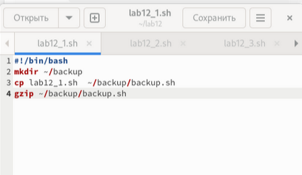
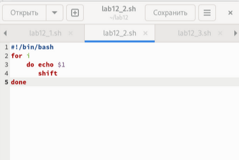
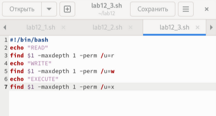
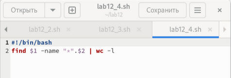

---
## Front matter
lang: ru-RU
title: Лабораторная работа №12
subtitle: Операционные системы
author:
  - Ким Д. В.
date: 2 мая 2025

## i18n babel
babel-lang: russian
babel-otherlangs: english

## Formatting pdf
toc: false
toc-title: Содержание
slide_level: 2
aspectratio: 169
section-titles: true
theme: metropolis
header-includes:
 - \metroset{progressbar=frametitle,sectionpage=progressbar,numbering=fraction}
---

## Цели 

-  Изучить основы программирования в оболочке ОС UNIX/Linux. Научиться писать небольшие командные файлы.

:::

## Процесс выполнения

{#fig:001 width=70%}

##

{#fig:002 width=70%}

##

{#fig:003 width=70%}

##

{#fig:004 width=70%}

:::

## Вывод

- В ходе выполнения данной лабораторной работы я изучил основы программирования в оболочке ОС UNIX/Linux и научился писать небольшие командные файлы и скрипты на языке bush.

:::
