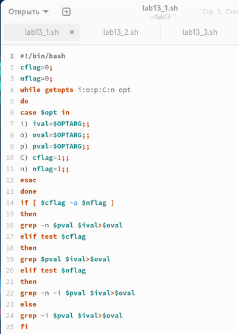
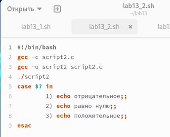
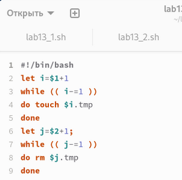
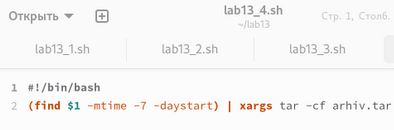

---
## Front matter
title: "Лабораторная работа №13"
subtitle: "Дисцпилина: Операционные системы"
author: "Денис Вячеславович Ким"

## Generic otions
lang: ru-RU
toc-title: "Содержание"

## Bibliography
bibliography: bib/cite.bib
csl: pandoc/csl/gost-r-7-0-5-2008-numeric.csl

## Pdf output format
toc: true # Table of contents
toc-depth: 2
lof: true # List of figures
fontsize: 12pt
linestretch: 1.5
papersize: a4
documentclass: scrreprt
## I18n polyglossia
polyglossia-lang:
  name: russian
  options:
	- spelling=modern
	- babelshorthands=true
polyglossia-otherlangs:
  name: english
## I18n babel
babel-lang: russian
babel-otherlangs: english
## Fonts
mainfont: IBM Plex Serif
romanfont: IBM Plex Serif
sansfont: IBM Plex Sans
monofont: IBM Plex Mono
mathfont: STIX Two Math
mainfontoptions: Ligatures=Common,Ligatures=TeX,Scale=0.94
romanfontoptions: Ligatures=Common,Ligatures=TeX,Scale=0.94
sansfontoptions: Ligatures=Common,Ligatures=TeX,Scale=MatchLowercase,Scale=0.94
monofontoptions: Scale=MatchLowercase,Scale=0.94,FakeStretch=0.9
mathfontoptions:
## Biblatex
biblatex: true
biblio-style: "gost-numeric"
biblatexoptions:
  - parentracker=true
  - backend=biber
  - hyperref=auto
  - language=auto
  - autolang=other*
  - citestyle=gost-numeric
## Pandoc-crossref LaTeX customization
figureTitle: "Рис."
tableTitle: "Таблица"
listingTitle: "Листинг"
lofTitle: "Список иллюстраций"
lotTitle: "Список таблиц"
lolTitle: "Листинги"
## Misc options
indent: true
header-includes:
  - \usepackage{indentfirst}
  - \usepackage{float} # keep figures where there are in the text
  - \floatplacement{figure}{H} # keep figures where there are in the text
---

# Цель работы

Изучить основы программирования в оболочке ОС UNIX. Научиться писать более сложные командные файлы с использованием логических управляющих конструкций и циклов.

# Выполнение лабораторной работы

Используя команды getopts grep напишем командный файл, который анализирует командную строку с ключами и выполним его: (рис. [-@fig:001])

{#fig:001 width=70%}

Напишем сначала на языке Си программу, которая вводит число и определяет, является ли оно больше нуля, меньше нуля или равно нулю. Затем завершим программу при помощи функции exit(n), передавая информацию о коде завершения в оболочку. Командный файл вызовет эту программу и, проанализировав с помощью команды $?, выдаст сообщение о том, какое число было введено: (рис. [-@fig:002])

{#fig:002 width=70%}

Напишем командный файл, создающий указанное число файлов, пронумерованных последовательно от 1 до N: (рис. [-@fig:003])

{#fig:003 width=70%}

Напишем командный файл, который с помощью команды tar запаковывает в архив все файлы в указанной директории. Модифицируем его так, чтобы запаковывались только те файлы, которые были изменены менее недели тому назад: (рис. [-@fig:004]).

{#fig:004 width=70%}

# Выводы

В ходе выполнения данной лабораторной работы я изучил основы программирования в оболочке ОС UNIX и научился писать более сложные командные файлы с использованием логических управляющих конструкций и циклов.

# Контрольные вопросы

1. Каково предназначение команды getopts? 
Ответ: Создание по пользовательским аргументам.
 
2. Какое отношение метасимволы имеют к генерации имён файлов? 
Ответ: Используют как файлы так и аргументы. 

3. Какие операторы управления действиями вы знаете? 
Ответ: If, else, elif, fi, while, do, done, until, do, done, for, in, do, done, case, in, esac 

4. Какие операторы используются для прерывания цикла? 
Ответ: 
a) for – будет выполнять действие до тех пор, пока есть объекты для выполнения. 
b) while – выполняет действие до тех пор, пока условие является истинным.
c) until – будет выполнятся пока условие не станет правдиво. 

5. Для чего нужны команды false и true? 
Ответ: until – будет выполняться до тех пор, пока условие не станет true, т.е. пока оно не станет false. 

6. Что означает строка if test -f man$s/$i.$s, встреченная в командном файле? 
Ответ: Проверяет если существует файл его размерность и тип c двумя разными расширениями, заменяя через переменные. 

7. Объясните различия между конструкциями while и until. 
Ответ: 
while – выполняет действие до тех пор, пока условие является истинным. 
until – будет выполняться до тех пор, пока условие не станет истинным, т.е. пока оно false.
:::
