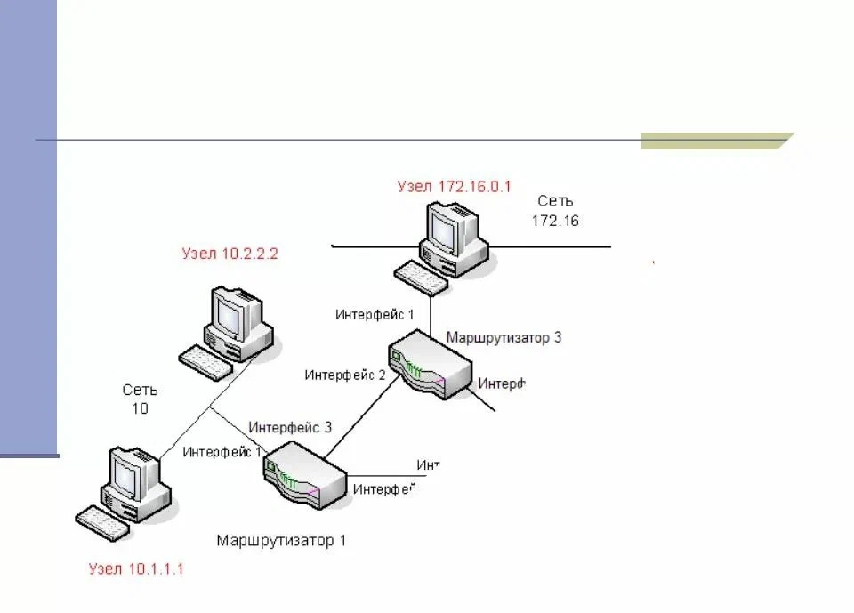

---
## Front matter
lang: ru-RU
title: Обзор стратегий маршрутизации и маршрутизаторов
subtitle: Операционные системы
author:
  - Ким Д. В.
date: 18 апреля 2025

## i18n babel
babel-lang: russian
babel-otherlangs: english

## Formatting pdf
toc: false
toc-title: Содержание
slide_level: 2
aspectratio: 169
section-titles: true
theme: metropolis
header-includes:
 - \metroset{progressbar=frametitle,sectionpage=progressbar,numbering=fraction}
---

# Вводная часть

## Актуальность

- Рост сложности структур сетей
- Важность эффективной маршрутизации
- Развитие технологий

## Объект и предмет исследования

- Маршрутизация и маршрутизаторы

## Цели и задачи

- Рассказать о маршрутизации и ее стратегиях
- Описать алгоритм работы маршрутизаторов

# Основная часть

## Маршрутизация

- Маршрутизация — процесс определения оптимального маршрута данных в сетях связи.

## Стратегии маршрутизации

- Фиксированная маршрутизация
- Путь от A к B задан заранее; он изменяется, только если им невозможно воспользоваться из-за отказов аппаратуры.

## Стратегии маршрутизации

- Виртуальная цепочка
- Путь от A к B фиксируется на время одного сеанса. Различные сеансы, включающие сообщения от A в B, могут иметь различную маршрутизацию

## Стратегии маршрутизации

- Статическая маршрутизация
- Администратор вручную задаёт маршруты в таблице маршрутизации, указывая, куда направлять трафик

## Стратегии маршрутизации

- Динамическая маршрутизация
- Путь для отправки сообщения от A к B определяется только в момент отправки данного сообщения

## Маршрутизаторы

- Маршрутизатор, или роутер — специализированное устройство, которое пересылает пакеты между различными сегментами сети на основе правил и таблиц маршрутизации.

## Маршрутизаторы

- Маршрутизаторы помогают уменьшить загрузку сети благодаря её разделению на домены коллизий или широковещательные домены, а также благодаря фильтрации пакетов
- В качестве маршрутизатора может выступать как специализированное (аппаратное) устройство, так и обычный компьютер, выполняющий функции маршрутизатора

# Заключение

## Заключение

- Маршрутизация сети является основополагающим элементом эффективной и надежной передачи данных. Она определяет оптимальный путь для передачи пакетов данных, что влияет на скорость и надёжность коммуникаций
- Без маршрутизации не было бы ни интернета, ни быстрых локальных сетей. Это фундамент современной цифровой инфраструктуры.

# Использованные материалы

- Википедия — свободная энциклопедия. Web: https://ru.wikipedia.org/wiki
- Национальный Открытый Университет «ИНТУИТ». Web: https://intuit.ru/studies/courses/641/497/lecture/11308?page=3
- Хабр. Web: https://habr.com/ru/articles/

